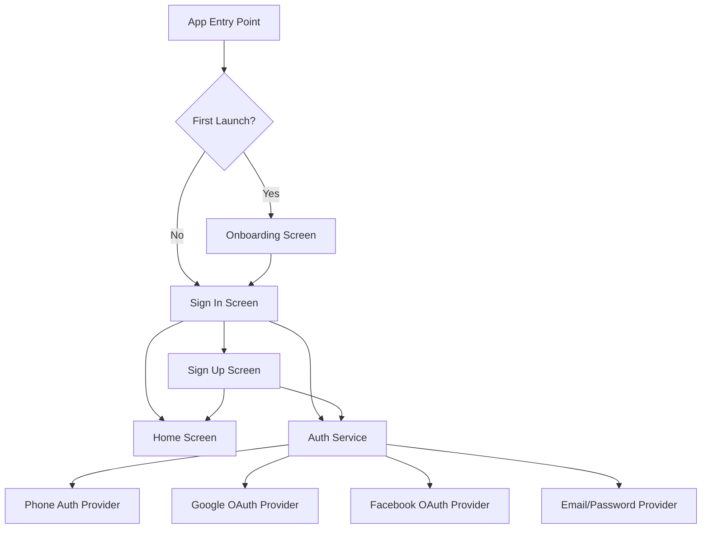
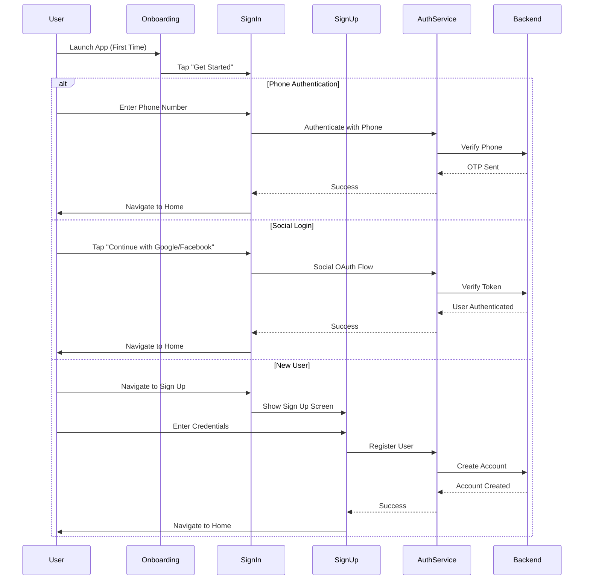

# Design Document: Nectar Onboard + SignIn/SignUp

## Overview

This feature implements the onboarding and authentication flow for the Nectar grocery delivery mobile application. The implementation includes three primary screens: a welcome/onboarding screen that introduces users to the app, a sign-in screen supporting phone number authentication and social login options (Google and Facebook), and a sign-up screen with email/password registration. The design follows React Native best practices with Expo, emphasizing a clean component architecture, secure authentication patterns, and smooth navigation transitions.

## Architecture

The authentication feature follows a screen-based architecture with shared components and centralized state management. The navigation flow is linear for first-time users (Onboarding → Sign In → Sign Up) with conditional routing for returning users.



## Navigation Flow



## Components and Interfaces

### Component 1: OnboardingScreen

**Purpose**: Introduces the app to first-time users with a welcome message and call-to-action

**Interface**:
```typescript
interface OnboardingScreenProps {
  navigation: NavigationProp<RootStackParamList, 'Onboarding'>
}

interface OnboardingScreen {
  render(): JSX.Element
  handleGetStarted(): void
}
```

**Responsibilities**:
- Display welcome message and app tagline
- Show background image with delivery person
- Provide "Get Started" button to navigate to Sign In
- Mark onboarding as completed in AsyncStorage

### Component 2: SignInScreen

**Purpose**: Handles user authentication via phone number or social media providers

**Interface**:
```typescript
interface SignInScreenProps {
  navigation: NavigationProp<RootStackParamList, 'SignIn'>
}

interface SignInScreen {
  render(): JSX.Element
  handlePhoneAuth(phoneNumber: string): Promise<void>
  handleGoogleAuth(): Promise<void>
  handleFacebookAuth(): Promise<void>
  navigateToSignUp(): void
}
```

**Responsibilities**:
- Display app logo and branding
- Provide phone number input with validation
- Offer social login buttons (Google, Facebook)
- Navigate to Sign Up screen for new users
- Handle authentication errors and loading states

### Component 3: SignUpScreen

**Purpose**: Allows new users to create an account with email and password

**Interface**:
```typescript
interface SignUpScreenProps {
  navigation: NavigationProp<RootStackParamList, 'SignUp'>
}

interface SignUpScreen {
  render(): JSX.Element
  handleSignUp(credentials: SignUpCredentials): Promise<void>
  validateEmail(email: string): boolean
  validatePassword(password: string): boolean
  togglePasswordVisibility(): void
  navigateToSignIn(): void
}
```

**Responsibilities**:
- Display sign-up form with username, email, and password fields
- Validate email format in real-time (show checkmark on valid)
- Provide password visibility toggle
- Display terms of service and privacy policy agreement
- Handle registration errors and loading states
- Navigate to Sign In for existing users

### Component 4: AuthService

**Purpose**: Centralized authentication logic and API communication

**Interface**:
```typescript
interface AuthService {
  authenticateWithPhone(phoneNumber: string): Promise<AuthResult>
  authenticateWithGoogle(): Promise<AuthResult>
  authenticateWithFacebook(): Promise<AuthResult>
  registerWithEmail(credentials: SignUpCredentials): Promise<AuthResult>
  logout(): Promise<void>
  getCurrentUser(): Promise<User | null>
  isAuthenticated(): boolean
}
```

**Responsibilities**:
- Manage authentication state
- Communicate with backend API
- Handle OAuth flows for social providers
- Store and retrieve authentication tokens
- Provide user session management

### Component 5: Shared UI Components

**Purpose**: Reusable UI elements across authentication screens

**Interface**:
```typescript
interface CustomButton {
  title: string
  onPress: () => void
  variant: 'primary' | 'social-google' | 'social-facebook'
  disabled?: boolean
  loading?: boolean
}

interface CustomInput {
  value: string
  onChangeText: (text: string) => void
  placeholder: string
  keyboardType?: KeyboardTypeOptions
  secureTextEntry?: boolean
  rightIcon?: JSX.Element
  error?: string
  validated?: boolean
}

interface Logo {
  size?: 'small' | 'medium' | 'large'
}
```

**Responsibilities**:
- Provide consistent button styling and behavior
- Offer validated input fields with error states
- Display app logo with configurable sizes

## Data Models

### Model 1: User

```typescript
interface User {
  id: string
  username: string
  email: string
  phoneNumber?: string
  profileImage?: string
  authProvider: 'phone' | 'google' | 'facebook' | 'email'
  createdAt: Date
  lastLoginAt: Date
}
```

**Validation Rules**:
- `id` must be a valid UUID
- `username` must be 3-50 characters, alphanumeric with underscores
- `email` must be a valid email format
- `phoneNumber` must be valid E.164 format (if provided)
- `authProvider` must be one of the specified enum values

### Model 2: SignUpCredentials

```typescript
interface SignUpCredentials {
  username: string
  email: string
  password: string
  agreedToTerms: boolean
}
```

**Validation Rules**:
- `username` must be 3-50 characters
- `email` must match email regex pattern
- `password` must be at least 8 characters with 1 uppercase, 1 lowercase, 1 number
- `agreedToTerms` must be true before submission

### Model 3: AuthResult

```typescript
interface AuthResult {
  success: boolean
  user?: User
  token?: string
  error?: AuthError
}

interface AuthError {
  code: string
  message: string
  field?: string
}
```

**Validation Rules**:
- If `success` is true, `user` and `token` must be present
- If `success` is false, `error` must be present
- `error.code` must be a recognized error code

### Model 4: NavigationParams

```typescript
type RootStackParamList = {
  Onboarding: undefined
  SignIn: undefined
  SignUp: undefined
  Home: { user: User }
}
```

**Validation Rules**:
- Navigation params must match defined types
- `Home` screen requires `user` parameter

## Error Handling

### Error Scenario 1: Invalid Phone Number

**Condition**: User enters phone number in incorrect format
**Response**: Display inline error message below input field: "Please enter a valid phone number"
**Recovery**: Allow user to correct input; clear error on valid input

### Error Scenario 2: Social Auth Cancelled

**Condition**: User cancels Google/Facebook OAuth flow
**Response**: Return to Sign In screen without error message
**Recovery**: User can retry authentication or choose different method

### Error Scenario 3: Email Already Exists

**Condition**: User attempts to sign up with email already registered
**Response**: Display error message: "This email is already registered. Please sign in."
**Recovery**: Provide link to navigate to Sign In screen

### Error Scenario 4: Weak Password

**Condition**: User enters password not meeting security requirements
**Response**: Display inline error: "Password must be at least 8 characters with uppercase, lowercase, and number"
**Recovery**: Allow user to enter stronger password; validate in real-time

### Error Scenario 5: Network Failure

**Condition**: API request fails due to network connectivity
**Response**: Display toast/alert: "Network error. Please check your connection and try again."
**Recovery**: Provide retry button; cache form data to prevent loss

### Error Scenario 6: Terms Not Accepted

**Condition**: User attempts to sign up without accepting terms
**Response**: Highlight checkbox with error color and message: "You must accept the terms to continue"
**Recovery**: User checks the agreement checkbox

## Correctness Properties

*A property is a characteristic or behavior that should hold true across all valid executions of a system—essentially, a formal statement about what the system should do. Properties serve as the bridge between human-readable specifications and machine-verifiable correctness guarantees.*

### Property 1: Onboarding Completion Persistence

*For any* rendering of the Onboarding_Screen, the onboarding completion flag SHALL be set in AsyncStorage.

**Validates: Requirements 1.4**

### Property 2: Phone Number Validation Correctness

*For any* string input, the phone number validator SHALL return true if and only if the string matches E.164 format.

**Validates: Requirements 2.1**

### Property 3: Phone Number Authentication API Call

*For any* valid E.164 phone number, when submitted for authentication, the Auth_Service SHALL send the phone number to the backend verification endpoint.

**Validates: Requirements 2.2**

### Property 4: Invalid Phone Number Error Display

*For any* invalid phone number input, the SignIn_Screen SHALL display the error message "Please enter a valid phone number".

**Validates: Requirements 2.5**

### Property 5: OAuth Token Backend Transmission

*For any* OAuth token received from a successful OAuth flow, the Auth_Service SHALL send the token to the backend verification endpoint.

**Validates: Requirements 3.3**

### Property 6: Email Validation with UI Feedback

*For any* email string input, the SignUp_Screen SHALL validate it against Valid_Email format and display a checkmark indicator if valid or an error message if invalid.

**Validates: Requirements 4.1, 4.2, 4.8**

### Property 7: Password Validation Correctness

*For any* password string, the password validator SHALL return true if and only if the password contains at least 8 characters with at least 1 uppercase letter, 1 lowercase letter, and 1 number.

**Validates: Requirements 4.3**

### Property 8: Password Visibility Toggle Idempotence

*For any* password visibility state, toggling visibility twice SHALL return to the original state (visible → hidden → visible, or hidden → visible → hidden).

**Validates: Requirements 4.4**

### Property 9: Registration API Call with Valid Credentials

*For any* valid SignUpCredentials with accepted terms, when submitted, the Auth_Service SHALL send the registration request to the backend with the correct credential data.

**Validates: Requirements 4.5**

### Property 10: Weak Password Error Display

*For any* password that does not meet Strong_Password requirements, the SignUp_Screen SHALL display the error message "Password must be at least 8 characters with uppercase, lowercase, and number".

**Validates: Requirements 4.9**

### Property 11: Terms Acceptance Validation

*For any* sign-up form submission attempt where agreedToTerms is false, the SignUp_Screen SHALL prevent submission and display the error message "You must accept the terms to continue".

**Validates: Requirements 5.2**

### Property 12: Terms Acceptance Timestamp Logging

*For any* successful user registration, the Auth_Service SHALL log a timestamp of terms acceptance.

**Validates: Requirements 5.4**

### Property 13: Email Exists Error Message Display

*For any* email-already-exists error received from the backend, the SignUp_Screen SHALL display the message "This email is already registered. Please sign in."

**Validates: Requirements 6.2**

### Property 14: Navigation Stack Integrity

*For any* sequence of navigation actions between authentication screens, the Navigation_System SHALL maintain a valid navigation stack state.

**Validates: Requirements 7.3**

### Property 15: Auth Token Storage on Success

*For any* successful authentication result with an Auth_Token, the Auth_Service SHALL store the token in AsyncStorage.

**Validates: Requirements 8.1**

### Property 16: Token Backend Verification Call

*For any* valid Auth_Token retrieved from storage, the Auth_Service SHALL call the backend verification endpoint.

**Validates: Requirements 8.3**

### Property 17: Token Removal on Logout

*For any* stored Auth_Token, when logout is called, the Auth_Service SHALL remove the token from AsyncStorage.

**Validates: Requirements 8.5**

### Property 18: Network Error Message Display

*For any* authentication API request that fails due to network connectivity, the system SHALL display the toast message "Network error. Please check your connection and try again."

**Validates: Requirements 9.1**

### Property 19: Form Data Preservation on Network Error

*For any* form state when a network error occurs during submission, the system SHALL preserve the form data without loss.

**Validates: Requirements 9.3**

### Property 20: Email Validation Debouncing

*For any* sequence of email input changes, the SignUp_Screen SHALL validate the email format with a 300ms debounce delay.

**Validates: Requirements 11.1**

### Property 21: Error Message Clearing on Valid Input

*For any* transition from invalid input to valid input, the system SHALL clear the associated error message.

**Validates: Requirements 11.4**

### Property 22: Form Validation Enforcement

*For any* form state that fails validation, the system SHALL prevent form submission.

**Validates: Requirements 11.5**

### Property 23: Secure Token Storage

*For any* Auth_Token value, the Auth_Service SHALL store it in secure storage (Expo SecureStore), not plain AsyncStorage.

**Validates: Requirements 12.1**

### Property 24: Password Plain Text Storage Prevention

*For any* password input, the Auth_Service SHALL never store the password in plain text in any storage mechanism.

**Validates: Requirements 12.2**

### Property 25: HTTPS-Only API Communication

*For any* API call made by the Auth_Service, the request SHALL use the HTTPS protocol exclusively.

**Validates: Requirements 12.3**

### Property 26: OAuth State Parameter Validation

*For any* OAuth authentication flow, the Auth_Service SHALL validate the OAuth state parameter to prevent CSRF attacks.

**Validates: Requirements 12.4**

### Property 27: Input Sanitization Before Backend Transmission

*For any* user input sent to the backend, the Auth_Service SHALL sanitize the input to prevent injection attacks.

**Validates: Requirements 12.5**

## Testing Strategy

### Unit Testing Approach

Test individual components and functions in isolation:
- **Input Validation**: Test email regex, password strength, phone number format validation
- **Component Rendering**: Verify each screen renders correctly with default props
- **Navigation**: Test navigation functions call correct routes with proper params
- **State Management**: Verify form state updates correctly on user input
- **Error Handling**: Test error message display for various validation failures

**Key Test Cases**:
- Valid email formats pass validation
- Invalid email formats fail validation
- Password visibility toggle works correctly
- Button disabled states work during loading
- Form submission prevented when validation fails

**Coverage Goal**: 80% code coverage for components and utilities

### Property-Based Testing Approach

Use property-based testing to verify authentication logic with random inputs:

**Property Test Library**: fast-check (for React Native/JavaScript)

**Configuration**: Minimum 100 iterations per property test

**Property Test Tags**: Each property test must reference its design document property using the format:
- **Feature: nectar-onboard-auth, Property {number}: {property_text}**

**Properties to Test**: See Correctness Properties section above for the complete list of 27 properties to implement as property-based tests.

### Integration Testing Approach

Test interactions between components and services:
- **Authentication Flow**: Test complete sign-in flow from input to navigation
- **Registration Flow**: Test complete sign-up flow with API mocking
- **Social Auth Flow**: Test OAuth redirect and callback handling
- **Error Recovery**: Test error scenarios and user recovery paths
- **Navigation Integration**: Test screen transitions and param passing

**Tools**: React Native Testing Library, Jest, Mock Service Worker (MSW) for API mocking

## Performance Considerations

- **Image Optimization**: Use optimized background images for onboarding screen; consider WebP format with fallback
- **Lazy Loading**: Load social auth SDKs only when needed (on Sign In screen mount)
- **Debouncing**: Debounce email validation to avoid excessive re-renders (300ms delay)
- **AsyncStorage**: Use AsyncStorage for onboarding completion flag and auth tokens
- **Navigation**: Use React Navigation's native stack for smooth transitions
- **Form State**: Use controlled components with minimal re-renders; consider useCallback for handlers

## Security Considerations

- **Password Storage**: Never store passwords in plain text; hash on backend before storage
- **Token Security**: Store auth tokens in secure storage (Expo SecureStore for production)
- **HTTPS Only**: All API communication must use HTTPS
- **OAuth Security**: Validate OAuth state parameter to prevent CSRF attacks
- **Input Sanitization**: Sanitize all user inputs before sending to backend
- **Rate Limiting**: Implement rate limiting on authentication endpoints to prevent brute force
- **Session Management**: Implement token expiration and refresh mechanism
- **Terms Acceptance**: Log timestamp of terms acceptance for legal compliance

## Dependencies

**Core Dependencies**:
- `react-native`: 0.81.5 (already installed)
- `expo`: ~54.0.33 (already installed)
- `@react-navigation/native`: ^6.x - Navigation framework
- `@react-navigation/native-stack`: ^6.x - Native stack navigator
- `react-native-screens`: Required by React Navigation
- `react-native-safe-area-context`: Safe area handling

**Authentication Dependencies**:
- `expo-auth-session`: OAuth flows for Google/Facebook
- `expo-web-browser`: Web browser for OAuth
- `@react-native-async-storage/async-storage`: Local storage for tokens and flags
- `expo-secure-store`: Secure token storage (production)

**UI Dependencies**:
- `react-native-vector-icons`: Icons for social buttons and input decorations
- `react-native-keyboard-aware-scroll-view`: Handle keyboard avoiding

**Validation Dependencies**:
- `validator`: Email and input validation utilities
- `libphonenumber-js`: Phone number validation and formatting

**Testing Dependencies**:
- `@testing-library/react-native`: Component testing
- `@testing-library/jest-native`: Additional matchers
- `jest`: Test runner (included with Expo)
- `fast-check`: Property-based testing
- `msw`: API mocking for integration tests
